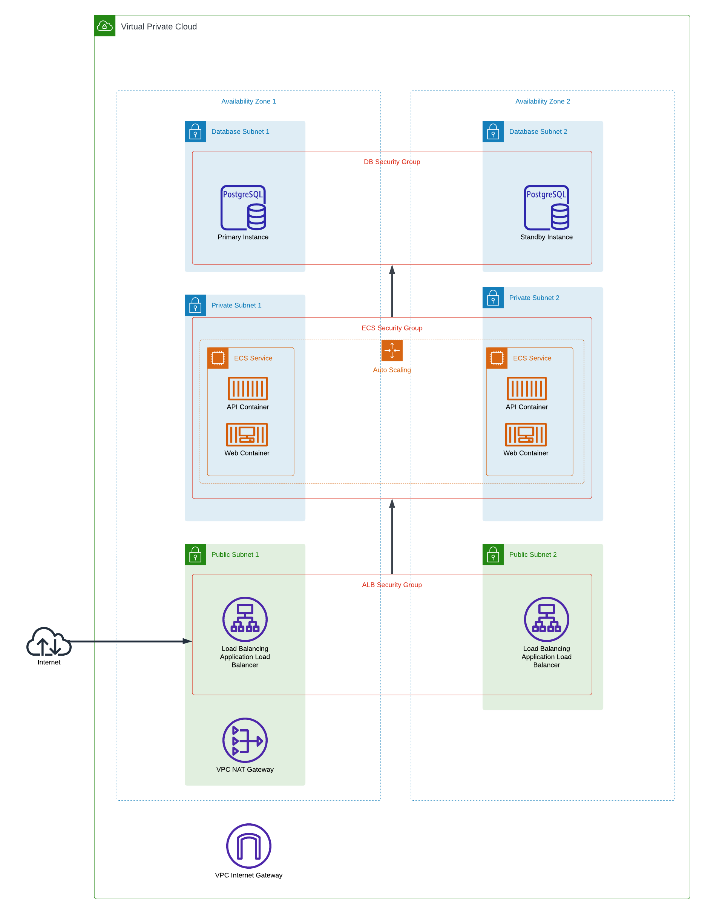

# Go API on AWS ECS
Golang API deployed on Amazon ECS with data persistence on Amazon RDS.

## Infrastructure 
### Architecture


### Deployment Order
The terraform infrastructure modules need to be deployed in the following order:
1. [`pre_deployment`](./infrastructure/terraform/pre_deployment/README.md): S3 bucket and DynamoDB table for terraform backends, ECR repository for container images.
2. [`vpc`](./infrastructure/terraform/vpc/README.md): VPC infrastructure and SGs.
3. [`db`](./infrastructure/terraform/db/README.md): RDS PostgreSQL database.
4. [`ecs`](./infrastructure/terraform/ecs/README.md): ECS cluster, service, and task definition, ALB for load balancing.


## Development Environment
### Pre-Commit Hooks
Install pre-commit hooks with:
```shell
pre-commit install
```

## Testing
### Generating Mocks
```shell
cd src 

go install github.com/vektra/mockery/v2@v2.20.0

go generate ./...
```
### Running Tests
To run tests:
```shell
go test -v -coverprofile=coverage.out ./...
go tool cover -func=coverage.out
```

### Deploy Development Server (Docker)
Deploy deployment server and PosgreSQL DB with `docker-compose`.
```shell 
cd .docker
docker-compose up --build

# Stop the server and database
docker-compose down
```

### Deploy Development Server
You can also deploy a development server without using `docker-compose`. 
However, you must provide a database server to connect to.
```shell
cd src

export BASIC_AUTH_USER="admin"
export BASIC_AUTH_PASSWORD="password"

export DB_USER="admin"
export DB_PASSWORD="password"
export DB_NAME="gorm"
export DB_HOST="localhost"
export DB_PORT="5432"
export DB_SSLMODE="disable"

go run .
```

export BASIC_AUTH_USER="cybersonic"
export BASIC_AUTH_PASSWORD="PzjS/kSaMngndTC81y1p5A=="

export BASE_URL="http://ecs-2138833276.us-east-1.elb.amazonaws.com"

## Usage
### Client Requests
```shell
export BASIC_AUTH_USER="admin"
export BASIC_AUTH_PASSWORD="password"

export BASE_URL="http://localhost:8080"

export API_URL="${BASE_URL}/api/v1"
export DOCS_URL="${BASE_URL}/api-docs"

export HEALTH_URL="${API_URL}/healthz"
export BOOK_URL="${API_URL}/book"

# Check health
curl -v "${HEALTH_URL}"

# Show API Documentation
curl -v "${DOCS_URL}"

# List books
curl -v "${BOOK_URL}" | jq

# Create book
curl -v -X POST \
  -u "${BASIC_AUTH_USER}:${BASIC_AUTH_PASSWORD}" \
  -H "Content-Type: application/json" \
  --data '{"title":"The Power of Geography","author":"Tim Marshall","year":2009}' \
  "${BOOK_URL}" | jq

# Read book
curl -v \
  -u "${BASIC_AUTH_USER}:${BASIC_AUTH_PASSWORD}" \
  "${BOOK_URL}/ID" | jq

# Update book
curl -v -X PUT \
  -u "${BASIC_AUTH_USER}:${BASIC_AUTH_PASSWORD}" \
  -H "Content-Type: application/json" \
  --data '{"title":"The Gods are to blame","author":"John Doe","year":1992}' \
  "${BOOK_URL}/ID" | jq

# Delete book
curl -v -X DELETE \
  -u "${BASIC_AUTH_USER}:${BASIC_AUTH_PASSWORD}" \
  "${BOOK_URL}/ID" | jq
```

## CI/CD
### Requirements
The terraform GitHub actions workflows require an OIDC provider to be deployed in an AWS account (ideally a CI account) for GitHub.
The ARN of 2 IAM roles must also passed as GitHub actions secrets:
1. `AWS_IAM_ROLE_ARN_CI`: An IAM role (in the CI account) which can be assumed by GitHub after authenticated with the OIDC provider.
2. `AWS_IAM_ROLE_ARN_DEPLOY`: An IAM role in the deployment account with the required permissions to deploy the resources and a trust policy to allow assumption by the `AWS_IAM_ROLE_ARN_CI` role.

### Source Code Build & Test
The [`Test source code`](./.github/workflows/go.yaml) workflow builds and tests the source code on every PR.

### Terraform Validation
The [`Validate terraform code`](./.github/workflows/infra_validate.yaml) workflow validates terraform configurations and runs TFLint on each infrastructure module.
The workflow requires the following GitHub actions secrets:
- [ ] `AWS_IAM_ROLE_ARN_CI`
- [ ] **`AWS_IAM_ROLE_ARN_DEPLOY`**
- [ ] `AWS_ACCOUNT_ID`
- [ ] `IMAGE_REPO_NAME`: Name of ECR repository for container images (provided as an output of the [`pre_deployment`](./infrastructure/terraform/pre_deployment/README.md) infrastructure module).
- [ ] `BASIC_AUTH_USER`
- [ ] `BASIC_AUTH_PASSWORD`

### Build and Push Image to ECR
[`Build and push image to ECR, deploy new task definition to ECS`](./.github/workflows/deploy.yaml) workflow is triggered whenever the source code changes.
It builds, tags, and pushes a new docker image to ECR, and re-deploys the API with the new image.
